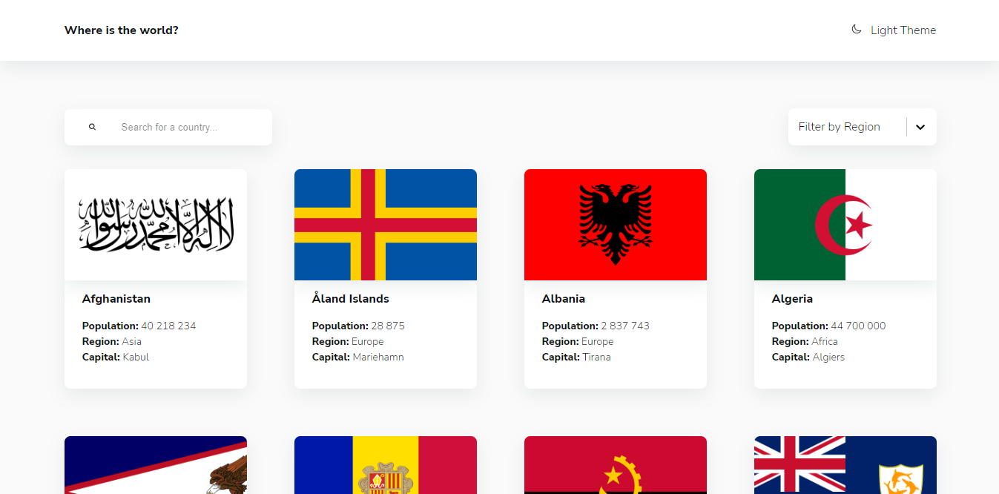
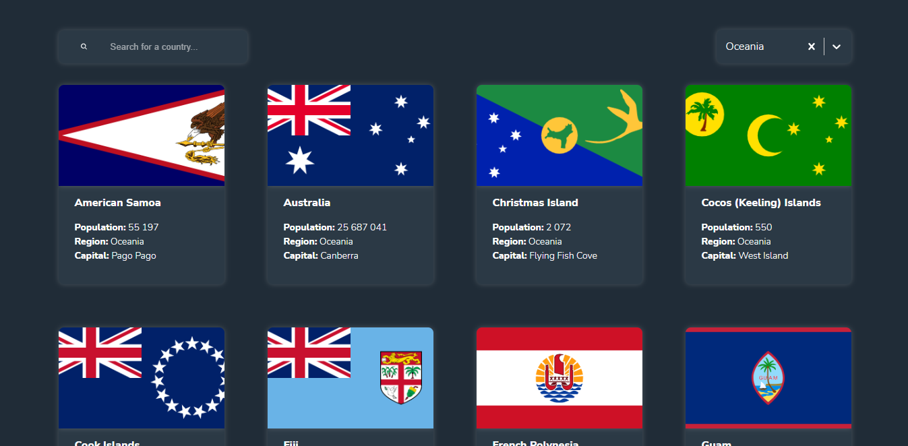
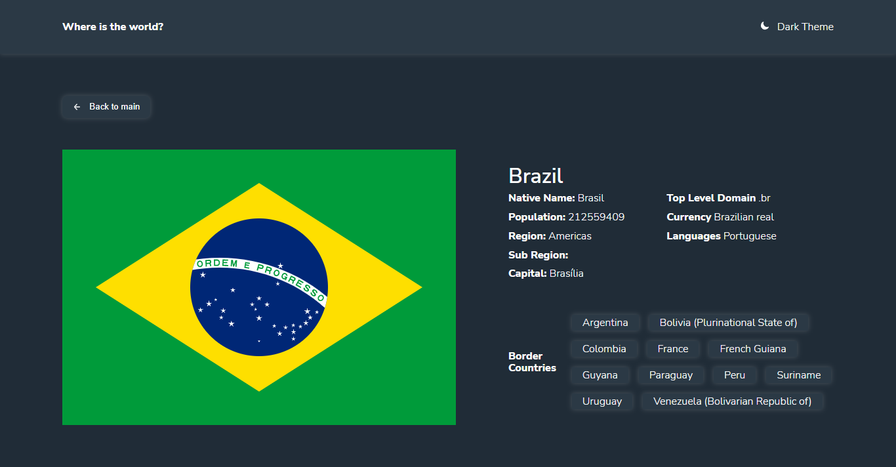

# country-api-app
-  Responsive React app based on REST Countries API
 
## General info
- In this app you can filter countries by region on main page or search for a country using an input field, click on chosen country to see detailed info on a separate page. Also you can switch light/dark mode

## Used technologies:
TypeScript, React, React Hooks, React Router, Redux Toolkit, Styled Components, React Select

## Screenshots




## Setup
To run this project, download and install it locally using npm:

```
$ npm install

```
